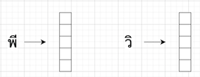
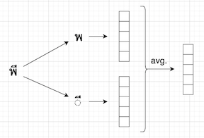
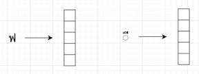

## Error Analysis for Different Embedding Systems
Author: Sahand Farhoodi (sahandfr@gmail.com, sahand.farhoodi93@gmail.com)

In this project, we develop a bi-directional LSTM model for word segmentation. For now, this model is implemented for Thai and Burmese.

### Background
In this document, we explore a range of different embedding systems for the [bi-directional LSTM word segmentation algorithm](https://github.com/SahandFarhoodi/word_segmentation) which predicts the word boundaries of a given sentence in **Thai** or **Burmese**. The first layer of this model is the embedding layer, where the input of the LSTM model, which is a sequence of characters or letters, is mapped to a sequence of numerical vectors. There are multiple options for the embedding layer that are thoroughly explained in [this document](https://docs.google.com/document/d/1KXnTvrgISYUplOk1NRbQbJssueeXa8k1Vu8YApMud4k/edit#heading=h.bmtbd2h7j5nt). Here, we consider three of these embedding systems and implement the word segmentation algorithm for them and compare them based on the model accuracy and model size. We also spend some time on error analyses based on these different embedding systems.

The embedding system highly depends on the units of a sentence that we consider to be used by our model for training. There are two choices:
* **Unicode code points**: These are often considered as the smallest part of a sentence or a word. Please see [this link](https://en.wikipedia.org/wiki/Code_point) for a formal definition.
* **Grapheme clusters**: Each grapheme cluster can have one or more code points in it. We can distinguish between these two types of grapheme clusters as single-code-point grapheme clusters and multi-code-point grapheme clusters. The reason that grapheme clusters are in many cases considered as the basic unit for word segmentation algorithms is that a word boundary should never occur in the middle of a grapheme cluster.

For a given language, e.g. Thai, the three embedding systems explored in this document are:

* **grapheme clusters vectors** (graph_clust): In this embedding system, first a set of grapheme clusters is found that cover 99% of the text in the given language. We use large corpora in the given language to obtain this set. Then, each grapheme cluster in this set is represented by a single vector of a fixed length. All other grapheme clusters are represented with a shared vector of the same length. For Thai and Burmese, this gives us an embedding matrix with ~350 vectors. These vectors are learned during the training of the LSTM model.

  

* **generalized vectors**: In this embedding system, each Unicode code point (or group of code points) in the given language is represented by a vector of a fixed length. Then, each grapheme cluster is represented by the average of vectors corresponding to code points in it. 

  
  
  This embedding system has different versions:
  * **Buckets 1, 2** (genvec_12): in this version, each code point with type 1 (letters) or 2 (marks) in the given language is represented with a separate vector. Other code points are grouped as follows, and elements of each group share a single vector:
    * All other letters that are not represented above
    * All other digits that are not represented above
    * All marks, punctuations, and symbols that are not represented above
    * All code points of type 4 (separators) and 7 (others) 

    In this version, we will have 
      * 136 embedding vectors for Burmese
      * 77 embedding vectors for Thai

  * **Buckets 1, 2, 3** (genvec_123): Same as the "Bucket 1,2" version, but now each code point with type 3 (digits) in the given language is also represented with a separate vector. In this version, we will have
      * 156 embedding vectors for Burmese
      * 87 embedding vectors for Thai
      
  * **Buckets 1, 2, digit 0** (genvec_12d0): Same as the "Bucket 1,2" version, but now the code points that represent digit 0 in the given language are represented with a new vector. In this version, we will have 
      * 138 embedding vectors for Burmese
      * 78 embedding vectors for Thai
      
  * **Buckets 1, 2, 5** (genvec_125): Same as the "Bucket 1,2" version, but now each code point with type 5 (punctuations) in the given language is also represented with a separate vector. In this version, we will have 
      * 142 embedding vectors for Burmese
      * 80 embedding vectors for Thai
      
    * **Buckets 1, 2, 3, 5** (genvec_1235): Same as the "Bucket 1,2" version, but now each code point with type 3 (digits) or type 5 (punctuations) in the given language is also represented with a separate vector. In this version, we will have 
      * 162 embedding vectors for Burmese
      * 90 embedding vectors for Thai
  
* **Code points**: In this embedding system, each single Unicode code point in a given language is represented with a single vector. This structure potentially lets the model put word boundaries inside a grapheme cluster. Hence, we need an extra normalizer algorithm that checks for this type of word boundaries and fixes them.

  

### Error Analysis
All the models described in this section are trained with the same training data sets, where the same number of epochs and batch sizes are used. The value of two important hyperparameters, number of hidden units (hunits) and embedding dimension, are calculated separately for each embedding system using the Bayesian optimization. The computed value for these two hyperparameters are as follows:

| Embedding | embedding dimension | hunits |
| :---:     |         :----:      | :---:  |
| Thai graph_clust | 16 | 23 |
| Thai codepoints | 40 | 27 |
| Thai genvec | 22 | 40 |
| Thai genvec light | 22  | 20  |
| Burmese graph_clust | 28  | 14  |
| Burmese genvec | 33  | 20  |

#### Grapheme Clusters vs. Generalized Vectors
Here, we investigate the difference between grapheme clusters and generalized vectors embedding systems. The following table shows the accuracy and model size of the fitted LSTM models for **Thai**.

| Embedding | BIES accuracy | F1-Score | Model size |
| :---:     |     :----:    |  :----:  |    :---:   |
| graph_clust | 92 | 85.3 | 27 KB |
| graph_clust_light | 91.9 | 85.2 | 22 KB |
| genvec_12 | 92.2 | 85.5 | 47 KB |
| genvec_123 | 92.3  | 85.7 | 47 KB |
| genvec_123_light | 91.9  | 85 | 20 KB |
| genvec_12d0 | 92.2  | 85.5  | 47 KB |
| genvec_125 | 92.1  | 85.3  | 47 KB |
| genvec_1235 | 92.1  | 85.5  | 47 KB |

The following table shows the accuracy and model size of the fitted LSTM models for **Burmese**.

| Embedding | BIES accuracy | F1-Score | Model size |
| :---:     |     :----:    |  :----:  |    :---:   |
| graph_clust | 91.7 | 90.4 | 30 KB |
| genvec_12 | 91.2 | 89.9 | 28 KB |
| genvec_123 | 91  | 89.6 | 30 KB |
| genvec_12d0 | 90.7  | 89.3  | 28 KB |
| genvec_125 | 91.1  | 89.7  | 28 KB |
| genvec_1235 | 91.5  | 90.2  | 29 KB |

Based on these tables, for Thai, it seems that whatever is achievable by generalized vectors can also be achieved by grapheme clusters (compare `graph_clust_light` with `genvec_123_light`, and `graph_clust` with `genvec_123`). For Burmese, it seems that using grapheme clusters is the better choice; it has a smaller data size and shows a better performance in terms of accuracy. However, our analysis shows that the generalized vector approach is also very viable, and can be used to give model accuracy very close to what can be achieved using grapheme clusters.

#### Grapheme Clusters vs. Code Points

Here, we investigate the difference between grapheme clusters and code point embedding systems. The following two tables show the accuracy and model size of the fitted LSTM models for Thai and Burmese. Note that for a fair comparison between these two embedding systems, looking at the BIES accuracy can be misleading. This is due to the fact the length of the BIES accuracy computed for code point embedding is often longer than that computed for grapheme clusters and hence the BIES accuracy tends to be higher for code point embeddings. For instance, consider the following example:

* Correct segmentation: |ใหญ่ซึ่ง| 
  
* Our segmentation: |ใหญ่|ซึ่ง|

In this case, the correct BIES sequence, the estimated BIES sequence, and BIES accuracy for grapheme clusters and code points will be:

* Grapheme cluster:
  * Correct segmentation BIES: biiie
  * Our segmentation BIES: biebe
  * BIES accuracy = 60

* Code point:
  * Correct segmentation BIES: biiiiiie
  * Our segmentation BIES: biiebiie
  * BIES accuracy = 75

Therefore, the code point version of BIES accuracy is higher for the same segmentation. For this reason, in this section, we only report F1-scores. The following table shows the accuracy and model size of the fitted LSTM models for **Thai**. Note that our comparison is slightly in favor of grapheme clusters because the value reported for code point is computed for models trained using Thai-specific script. This means that we had to exclude all spaces, marks, and Latin letters from the original data which results in much shorter sentences, and can adversely affect the model accuracy.

| Embedding |  F1-Score | Model size |
| :---:     |   :----:  |    :---:   |
| graph_clust | 88.7 | 28 KB
| codepoints light | 88.9 |  28 KB |
| codepoints | 90.1  | 36 KB |

The following table shows the accuracy and model size of the fitted LSTM models for **Burmese**. Given that there are potentially many spaces in Burmese texts, training models using Burmese-specific script results in considerably lower accuracy. Therefore, in order to make a fair comparison between grapheme clusters and code point embeddings, values reported in the following table are for models trained on the original data sets.

| Embedding |  F1-Score | Model size |
| :---:     |   :----:  |    :---:   |
| graph_clust | 92.9 | 30 KB
| codepoints light |  93 | 20 KB |
| codepoints | 93.4 | 45 KB |

Based on these tables, for models of the same size, we see that code points embedding gives slightly better accuracy (compare `graph_clust` to `codepoint light` for Thai table). Besides, by using larger code points models we get considerably better performance (third row of the Thai table). We weren't able to achieve that level of accuracy using grapheme clusters, even when we train models larger than what we show in these tables.

#### Case-by-case Analysis

In what follows, we use some sample examples to see what kind of sentences in **Thai** to see how different algorithms segment them:

| Algorithm |  Output |
| :---:     |  :----  |
| Unsegmented | `การเดินทางใน` |
|  Manually Segmented | `\|การ\|เดินทาง\|ใน\|` |
|  Deepcut | `\|การ\|เดินทาง\|ใน\|` |
|  ICU | `\|การ\|เดิน\|ทางใน\|` |
|  Grapheme Clusters | `\|การ\|เดิน\|ทาง\|ใน\|` |
|  Generalized Vectors | `\|การ\|เดิน\|ทาง\|ใ\|น\|` |
|  Code Points | `\|การ\|เดินทาง\|ใน\|` |

**Test Case 3**

| Algorithm |  Output |
| :---:     |  :----  |
| Unsegmented | `นั่งนายกฯต่อสมัยหน้า` |
|  Manually Segmented | `\|นั่ง\|นายก\|ฯ\|ต่อ\|สมัย\|หน้า\|` |
|  Deepcut | `\|นั่ง\|นายก\|ฯ\|ต่อ\|สมัย\|หน้า\|` |
|  ICU | `\|นั่ง\|นา\|ยกฯ\|ต่อ\|สมัย\|หน้า\|` |
|  Grapheme Clusters | `\|นั่ง\|นายก\|ฯ\|ต่อ\|สมัย\|หน้า\|` |
|  Generalized Vectors | `\|นั่ง\|นายก\|ฯ\|ต่อสมัยหน้า\|` |
|  Code Points | `\|นั่ง\|นายก\|ฯ\|ต่อ\|สมัย\|หน้า\|` |

**Test Case 4**

| Algorithm |  Output |
| :---:     |  :----  |
| Unsegmented | `พร้อมจัดตั้ง` |
|  Manually Segmented | `\|พร้อม\|จัดตั้ง\|` |
|  Deepcut | `\|พร้อม\|จัด\|ตั้ง\|` |
|  ICU | `\|พร้อม\|จัด\|ตั้ง\|` |
|  Grapheme Clusters | `\|พร้อม\|จัด\|ตั้ง\|` |
|  Generalized Vectors | `\|พร้อม\|จัด\|ตั้ง\|` |
|  Code Points | `\|พร้อม\|จัดตั้ง\|` |

**Test Case 5**

| Algorithm |  Output |
| :---:     |  :----  |
| Unsegmented | `เพราะดนตรีที่ชอบนั้น` |
|  Manually Segmented | `\|เพราะ\|ดนตรี\|ที่\|ชอบ\|นั้น\|` |
|  Deepcut | `\|เพราะ\|ดนตรี\|ที่\|ชอบ\|นั้น\|` |
|  ICU | `\|เพราะ\|ดนตรี\|ที่\|ชอบ\|นั้น\|` |
|  Grapheme Clusters | `\|เพราะ\|ดนตรี\|ที่\|ชอบ\|นั้น\|` |
|  Generalized Vectors | `\|เ\|พราะดนตรี\|ที่\|ชอบ\|นั้น\|` |
|  Code Points | `\|เพราะ\|ดนตรี\|ที่\|ชอบ\|นั้น\|` |

In what follows, we use some sample examples to see what kind of sentences in **Burmese** to see how different algorithms segment them:

**Test Case 1**

| Algorithm |  Output |
| :---:     |  :----  |
| Unsegmented | `ဖော်ပြထားသည့်` |
|  Manually Segmented | `\|ဖော်ပြ\|ထားသည့်\|` |
|  ICU | `\|ဖော်ပြ\|ထား\|သည့်\|` |
|  Grapheme Clusters | `\|ဖော်\|ပြ\|ထား\|သည့်\| ` |
|  Generalized Vectors | `\|ဖော်\|ပြ\|ထား\|သည့်\|` |
|  Code Points | `\|ဖော်ပြ\|ထား\|သည့်\` |

**Test Case 2**

| Algorithm |  Output |
| :---:     |  :----  |
| Unsegmented | `အသားအရောင်အားဖြင့်` |
|  Manually Segmented | `\|အသားအရောင်\|အားဖြင့်\|` |
|  ICU | `\|အသား\|အရောင်\|အားဖြင့်\|` |
|  Grapheme Clusters | `\|အသား\|အရောင်\|အား\|ဖြင့်\|` |
|  Generalized Vectors | `\|အသား\|အရောင်\|အား\|ဖြင့်\|` |
|  Code Points | `\|အသားအရောင်\|အားဖြင့်\|` |

**Test Case 3**

| Algorithm |  Output |
| :---:     |  :----  |
| Unsegmented | `သဘာဝအားဖြင့်` |
|  Manually Segmented | `\|သဘာဝ\|အားဖြင့်\|` |
|  ICU | `\|သဘာ\|ဝ\|အားဖြင့်\|` |
|  Grapheme Clusters | `\|သဘာ\|ဝ\|အား\|ဖြင့်\|` |
|  Generalized Vectors | `\|သဘာ\|ဝအား\|ဖြင့်\|` |
|  Code Points | `\|သဘာ\|ဝ\|အား\|ဖြင့်\|` |

**Test Case 4**

| Algorithm |  Output |
| :---:     |  :----  |
| Unsegmented | `ထို့ပြင်` |
|  Manually Segmented | `\|ထို့ပြင်\|` |
|  ICU | `\|ထို့ပြင်\|` |
|  Grapheme Clusters | `\|ထို့\|ပြင်\|` |
|  Generalized Vectors | `\|ထို့\|ပြင်\|` |
|  Code Points | `\|ထို့ပြင်\|` |

**Test Case 5**

| Algorithm |  Output |
| :---:     |  :----  |
| Unsegmented | `နိုင်ငံရေးဆိုင်ရာ` |
|  Manually Segmented | `\|နိုင်ငံရေး\|ဆိုင်ရာ\|` |
|  ICU | `\|နိုင်ငံရေး\|ဆိုင်ရာ\|` |
|  Grapheme Clusters | `\|နိုင်ငံရေး\|ဆိုင်ရာ\|` |
|  Generalized Vectors | `\|နိုင်ငံရေး\|ဆိုင်ရာ\|` |
|  Code Points | `\|နိုင်ငံရေး\|ဆိုင်ရာ\|` |

### Conclusions

Based on these analyses, it seems that for both Burmese and Thai, code points embedding is the most favorable option. This embedding system is capable of giving better accuracies and often is easier to implement. It also requires less preprocessing than the grapheme clusters approach at training time where we have to find the most common grapheme clusters first. Furthermore, at the evaluation time where we don't need to segment a sentence into its grapheme clusters anymore. Another advantage of the code point embedding is that in contrast to the grapheme clusters embedding we don't need to store any extra dictionary in the model. 

One disadvantage of code point embedding is that since sentences are longer when we use code points instead of grapheme clusters, this type of embedding probably requires models to have a larger number of hidden units to learn the same amount of context. This can make them have a larger model size. However, this extra data size is covered in many cases with the reduction that we get in the embedding matrix, by having for example at most 73 columns for code points instead of 350 columns for grapheme clusters for Thai. 

Another advantage of code points models (shared with generalized vectors models) is that they probably perform better for sentences for rare/unseen grapheme clusters. Such occasions can happen frequently, when we are using our algorithms to segment non-formal texts, such as text messages. For instance, to come up with an English example, one may use "the meeting is tooooo long" instead of "the meeting is too long", which has a word (it can be a grapheme cluster in Thai) that is not a formal word, and therefore can be problematic for grapheme clusters approach.
