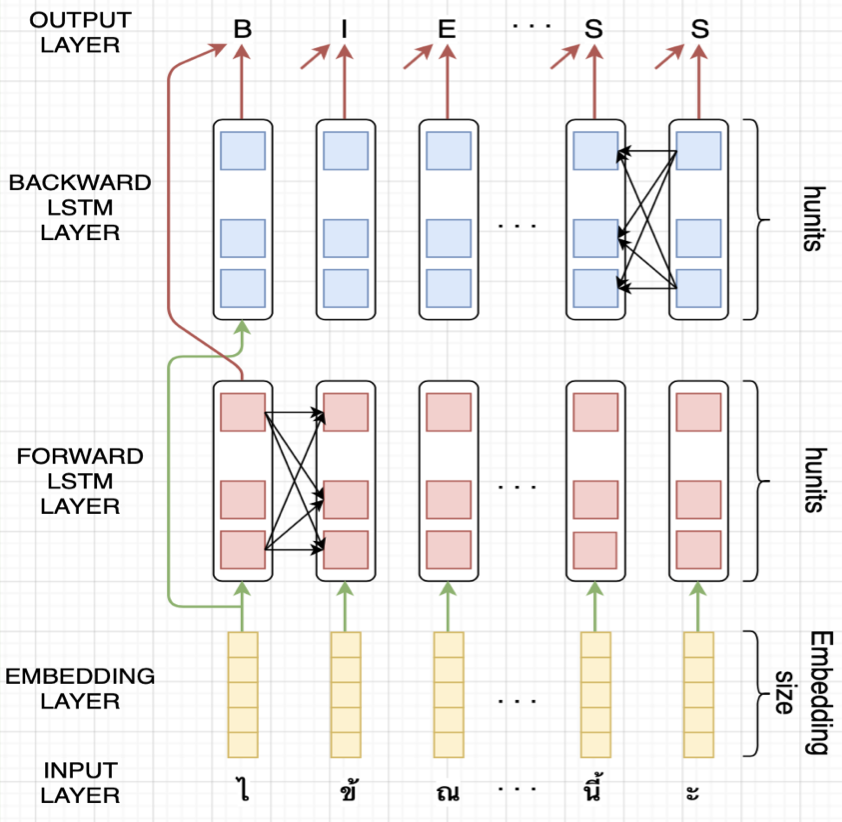
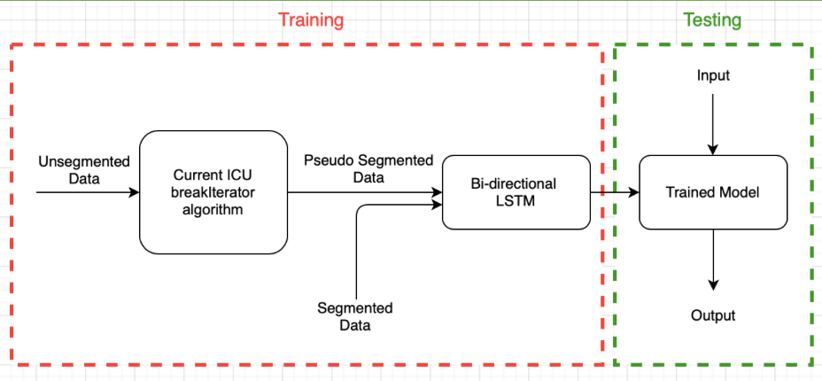

## LSTM-based Model for Word Segmentation
Author: Sahand Farhoodi (sahandfr@gmail.com, sahand.farhoodi93@gmail.com)

In this project, we develop a bi-directional LSTM model for word segmentation. For now, these models are trained for Thai and Burmese.

### Quick start
* **Use a pre-trained model:** To segment an arbitrary line go to file `train_language.py` where `language` is the language you want to use. For example, if the arbitrary line is in Thai, you should use the file `train_thai.py`. Over there, find comment `# Choose one of the saved models to use`. Everything before this line is for training a new model and can be ignored. After this comment, you can use the function `pick_lstm_model` to choose the model you want to use for segmentation:
  ```python
word_segmenter = pick_lstm_model(model_name="Thai_codepoints_exclusive_model4_heavy", embedding="codepoints",
                                 train_data="exclusive BEST", eval_data="exclusive BEST")
  ```
You need to specify three hyper-parameters: `embedding`, `train_data`, and `eval_data`. Please refer to [Models Specicitaions](https://github.com/SahandFarhoodi/word_segmentation/blob/work/Models%20Specifications.md) on this repository for a detailed explanation of these hyper-parameters, and also for a list of trained models ready to be used in this repository and their specifications. If you don't have time to do that, just pick one of the trained models and make sure that name of the embedding you choose appears in the model name (`train_data` and `eval-data` doesn't affect segmentation of arbitrary inputs). Next, you can use the following commands to specify your input and segment it:
```python
line = "ทำสิ่งต่างๆ ได้มากขึ้นขณะที่อุปกรณ์ล็อกและชาร์จอยู่ด้วยโหมดแอมเบียนท์"
word_segmenter.segment_arbitrary_line(line)
```

* **Train a new model:** In order to train a new model in Thai or Burmese, you need to use file `train_language.py` where `language` is the language you want to work with. Over there, you need to use the code between comments `# Train a new model -- choose name cautiously to not overwrite other models` and `# Choose one of the saved models to use`. The following code let you define a new model:
  ```python
model_name = "Thai_new_model"
word_segmenter = WordSegmenter(input_name=model_name, input_n=50, input_t=10000, input_clusters_num=350,
                               input_embedding_dim=16, input_hunits=23, input_dropout_rate=0.2, input_output_dim=4,
                               input_epochs=1, input_training_data="exclusive BEST",
                               input_evaluation_data="exclusive BEST", input_language="Thai",
                               input_embedding_type="codepoints")
  ```
There are some hyperparameters need to be specified that are explained in detail in [Models Specifications](https://github.com/SahandFarhoodi/word_segmentation/blob/work/Models%20Specifications.md). After specifying your model, you can use function `word_segmenter.train_model()` to train your model, `word_segmenter.save_model()` to save it, and `word_segmenter.test_model_line_by_line()` to test it:
  ```python
  word_segmenter.train_model()
word_segmenter.save_model()
word_segmenter.test_model_line_by_line(verbose=True)
  ```  
This repository is developed in a way that makes the process of training models in a new language semi-automatic. If you are interested in doing so, you need to find appropriate data sets (or decide to use the unsupervised learning option), add a couple of lines in `word_segmenter.py` and `constants.py` that let you use those data sets, use the `LSTMBayesianOptimization` class to estimate the values of `hunits` and `embedding_dim` (see [Models Specifications](https://github.com/SahandFarhoodi/word_segmentation/blob/work/Models%20Specifications.md) for details), and then train your models as above. You may also need to do some extra preprocessing (see `preproceee.py`) if you decide to use grapheme clusters embedding. Feel free to contact me if you think I can help you with this. 

### Model structure
Figure 1 illustrates our bi-directional model structure. Below we explain what are different layers:

* **Input Layer**: In the input layer we have a sequence of letters or characters that we want to segment. To be more specific, when you look at a string you can see it as a sequence of code points or [extended grapheme clusters](https://unicode.org/reports/tr29/). The choice of units for your input sequence (grapheme clusters or code points) results in different models, which should be chosen carefully. The code in this repository supports both of these options.

* **Embedding Layer**: In the embedding layer, we represent each unit of the input line (grapheme cluster or code point) with a numerical vector so it can be used by the rest of the model. The choice of embedding can significantly affect the model size and performance. The length of each embedding vector is denoted by *embedding size* throughout the rest of this document. In this repository, three types of embeddings are implemented:
  * **grapheme clusters to vectors**: In this approach, each grapheme cluster is mapped to a single vector. These vectors are learned during model training and need to be stored to be used later for evaluation. Given that the set of possible grapheme clusters is theoretically infinity, we cannot store one vector for each possible grapheme clusters. Hence, we use large corpora to extract all grapheme clusters that actually happen in texts. Then we sort these grapheme clusters based on their frequency in the corpora and store one vector for those grapheme clusters that cover 99% of the text, and one vector for any other grapheme cluster. Using this approach, we need to store about 350 grapheme cluster vectors for Thai and Burmese. 
  * **Generalized encoding vectors**: In this approach, each code point is mapped to a vector that is learned during training, and then the vector computed for a grapheme cluster is the average of vectors corresponding to code points in it. The number of code points in a language is fixed and considerably less than the number of grapheme clusters, and hence the embedding matrix will have a smaller size using this approach. However, this approach typically requires a larger number of hidden units and embedding size in the model. There are variations of this approach (explained in [Embedding Discussion](https://github.com/SahandFarhoodi/word_segmentation/blob/work/Embeddings%20Discussion.md)) that are centered around the idea of having one vector for a group of code points that we believe behave similarly, such as digits.
  * **code points to vectors**: In this approach, each code point is mapped to a single vector and these vectors are used directly in the remaining of the model. Therefore, in contrast to the two previous methods, here the smallest part of a sentence is code point instead of grapheme clusters. Again, this approach reduces the number of vectors we need to store, but often increases the number of hidden units and also the embedding size. 
* **Forward/Backward LSTM Layers**: The output of the embedding layer is fed into the forward and backward LSTM layers. We show the number of hidden units in each cell of LSTM by *hunits*.

* **Output Layer**: Here, the output of forward and backward LSTM layers are concatenated and fed into a dense layer with *softmax* activation function to make a vector of length four for each grapheme cluster. The values in each vector add up to 1 and are probabilities of *BIES*, where:
  * *B* stands for beginning of a word.
  * *I* stands for inside of a word.
  * *E* stands for end of a word.
  * *S* stands for a single grapheme cluster that forms a word by itself.

* **Dropout Layers**: We have two dropout layers in our model; one right after the embedding layer and one before the output layer.




### Estimating hyperparameters of the model
There are many hyperparameters in the model that need to be estimated before using it. Among different hyper-parameters, there are two that affect the model size and performance more significantly: *hunits* and *embedding size*. We use a stepwise grid-search to decide on all hyper-parameters except these two such as *learning rate*, *batch size*, and *dropout rate*. For *hunits* and *embedding size* we use [Bayesian optimization](https://github.com/fmfn/BayesianOptimization) which is much more computationally expensive, but guarantees a better estimation of these parameters.

### Data sets
For some languages, there are manually annotated data sets that can be used to train learning-based models. However, for some other languages, such data sets don't exist. We develop a framework that let us train our model in both scenarios. In this framework (shown in Figure 2), if a manually segmented data set exists then we use it directly to train our model (supervised learning). Otherwise, if such data set doesn't exist (unsupervised learning), we use one of the existing algorithms such as the current ICU algorithm to generate pseudo segmented data, and then use that to train our model. We use ICU specifically because it already supports word segmentation for almost all languages, it is light, fast, and has acceptable accuracy. However, for some specific languages with better word segmentation algorithms ICU can be replaced. Our analysis shows that in the absence of a segmented data set, our algorithm is capable of learning what ICU does, and in a few cases, it can outperform ICU. Below we explain the data sets used to train and test models for Thai and Burmese:

* **Thai**: We use [NECTEC BEST data set](https://thailang.nectec.or.th/downloadcenter/index4c74.html?option=com_docman&task=cat_view&gid=42&Itemid=61) to train our model. The text files in this dataset use UTF-8 encoding and are manually segmented. There are four different genres of text in this data set: novel, news, encyclopedia, and article. For testing the model, we use both NECTEC BEST data set and Google SAFT data.
* **Burmese**: For Burmese, we use the [Google corpus crawler](https://github.com/google/corpuscrawler) to collect unsegmented texts, and then use ICU to generate a pseudo segmented data set to be used for training. For testing, we use both pseudo segmented texts and Google SAFT data.



### Performance summary
There are two sets of trained models, one set is models trained using the language-specific script (models with `exclusive` in their name) where all other characters, including spaces, marks, and Latin letters are excluded from the data. This forces the model to be trained on much smaller sentences and can lower its accuracy. However, these models are completely compatible with the structure of ICU4C word segmenter, and can replace language engines for Thai and Burmese directly. The second set of models are trained using standard data sets (with spaces, marks, Latin letters in them) and give better accuracies. These models can be used in ICU4X, and also in ICU4C if some changes are made to its current structure. Below we present the performance of the first set of models and compare them to existing algorithms:

* **Thai**: The following table summarizes the performance of our algorithm alongside that of the state of the art algorithm [Deepcut](https://github.com/rkcosmos/deepcut) and current ICU algorithm. We have different versions of our algorithm, where LSTM model 7 and LSTM model 5 are respectively the most accurate and the most parsimonious models, and LSTM model 4 sits somewhere between these two and provides a high accuracy while still has a small data size. Based on the following table, Deepcut is by far the largest model which makes its applications in industry limited. **ADD HERE on performance of different lstms**.  Deepcut outperforms all other methods in terms of accuracy by a considerable margin when the BEST data is used. However, for the SAFT data, which is not the data used to train Deepcut, this margin drops significantly.

| Algorithm | BIES accuracy (BEST) | F1-score (BEST) | BIES accuracy (SAFT) | F1-score (SAFT) | Model size |
| :---:     |         :----:       |      :---:      |         :----:       |      :---:      | :---:  |
| LSTM model 4  | 94.5 | 89.9 | 91.5 | 83.9 | 27 KB |
| LSTM model 5  | 92.6 | 86.6 | 88.9 | 79.6 | 10 KB |
| LSTM model 7  |  96  | 92.4 | 92 | 84.9 | 86 KB |
| Deepcut        | 97.8 | 95.7 | 92.6 | 86  | 2.2 MB |
| ICU            | 93 | 86.4 | 90.3 | 81.9 | 126 KB |

* **Burmese**: 
The following table summarizes the performance of our algorithm and the current ICU algorithm for Burmese. Again, we have different versions of our LSTM models, where LSTM model 7 and LSTM model 5 are respectively the most accurate and the most parsimonious models. Based on this table, **ADD HERE**

| Algorithm | BIES accuracy (ICU segmented) | F1-score (ICU segmented) | BIES accuracy (SAFT) | F1-score (SAFT) | Model size |
| :---:     |         :----:                |      :---:               |     :---:  |   :---: | :---: |
| LSTM model 4 | 94.7 | 92.9 | 91.7 | 90.5 | 30 KB  |
| LSTM model 5 | 93.4 | 81.1 | 91.4 | 90.1 | 15 KB |
| LSTM model 7 | 96.2 | 94.9 | 92.3 | 91.1 | 125 KB |
| ICU           | 100  | 100  | 93.1 | 92.4 | 254 KB |

There are areas that this project can be improved. Please see [Future Works](https://github.com/SahandFarhoodi/word_segmentation/blob/work/Future%20Works.md) for some ideas we have, and contact [me](http://math.bu.edu/people/sahand/) if you have any idea!